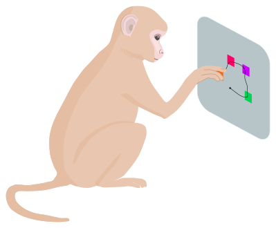

---
# Feel free to add content and custom Front Matter to this file.
# To modify the layout, see https://jekyllrb.com/docs/themes/#overriding-theme-defaults

layout: single
author_profile: true
title: Scientific illustration
permalink: /Illustration/
classes: wide
---

### Issue Image

[(2020) PLoS Computational Biology Issue Image](https://journals.plos.org/ploscompbiol/issue?id=10.1371/issue.pcbi.v16.i01) | Vol. 16(1) January 2020. PLOS Computational Biology 16(1): ev16.i01. [https://doi.org/10.1371/image.pcbi.v16.i01](https://doi.org/10.1371/image.pcbi.v16.i01)

### SciDraw contributions

Monkey (Arm Movement). Available at [SciDraw](https://scidraw.io/drawing/445). [doi:10.5281/zenodo.4662738](https://10.0.20.161/zenodo.4662738)

